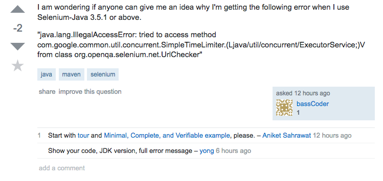
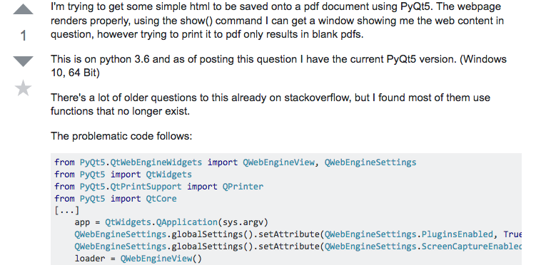

Smart Questions Do Exist

Naryssa Fia

ICS 314 University of Hawaii, Manoa

 Grade school teachers always said, “there are no dumb questions”. But what about smart questions? Within software engineering, questions and requests for help are everywhere, especially with the popularity of open source software and open discussion sites, such as Stackoverflow. Due to software and programming languages continually changing, it is crucial to be a very detail-oriented software engineer, especially when asking questions and discussing software engineering related topics. Raymond and Moen’s “How to Ask Questions the Smart Way” details how to formulate smart, detail-packed questions that will enhance one’s chances of getting just as good of an answer. 
    
The first step is for one to answer their own question. Even if an answer is not found in this first step, the person asking gains some knowledge on what options are not viable solutions to the original question [1]. The next step is to ask the question in the correct place. Whether it be through email, or on a forum, asking in the right place is crucial to getting others’ attention in the first place. If using a forum, asking in the right type of forum (i.e. don’t ask about a Java problem in a Python forum). It is also helpful for one to use a detailed subject header when posting or sending a question. This also helps the person asking to really think about exactly what is wrong, and gives the person being asked a quick and summarized idea of what the real question entails. Lastly, don’t assume there’s a bug, and be as descriptive as possible with the question[1]. 
    
With these rules of smart questions in mind, let’s take a look at some examples from Stackoverflow. First, let’s look at what would not be a smart question.

Notice how the title is still somewhat vague. The user notes they are using Selenium Java 3.5.1, but the error, and the context in which the error being experienced is not clear to the reader. When reading the user’s question, the user does not give any context for the error. What kind of program is this? Could they provide the code associated with the error? What is the end goal of the code? Where is this error being experienced? Note that this question is not marked as answered, and there are comments requesting more information on the issue.
    
Each project created is very unique, and there could be a plethora of reasons why this error is being experienced. Therefore it is of utmost importance that this user provide more details on this error in order to receive any help from those who may be able to provide some sort of insight.

Next is a good example of a smart question. The subject header is very descriptive, including the end-goal of the code and version being used. The question itself is very detailed. The user explains their end goal, gives the versions of the language and rig being used, provides code associated with the question, and explains what options have already been ruled out. This question received an answer just as descriptive and illustrative with code provided.

After analyzing the type of questions other users have shared on Stackoverflow, I have found that there is a multitude of ways in which one can formulate a detailed, illustrative, and easy-to-answer question, or even answer their own question in the process. Raymond and Moen’s, “How to Ask Questions the Smart Way” broke down each way one can enhance a question being asked, and the importance of improving questions in those ways. 


Citations
[1] Raymond, E. S., & Moen, R. (n.d.). How To Ask Questions The Smart Way. Retrieved January 24, 2018, from http://www.catb.org/esr/faqs/smart-questions.html  
